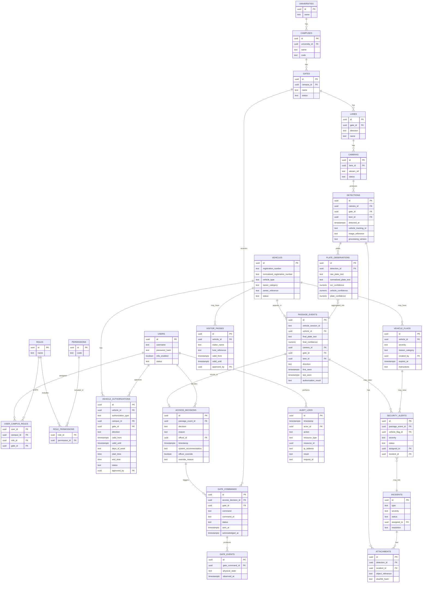

# Data Model — Entity Relationship Diagram

Status: DRAFT. Field lists are illustrative; authoritative definitions are in
`database/migrations/0001_initial_schema.sql`.

## Notes

- `normalized_registration_number` is indexed on `vehicles` and `plate_observations`
  for fast lookup; see migration for exact index list.
- `owner_reference` is an opaque pointer into MSU's authoritative student/staff
  system — this platform does not duplicate personal records (SRS FR-026, §7).
- Raw OCR text is never overwritten; `plate_observations` is append-only per
  detection frame, and `passage_events.final_plate_text` records only the
  aggregated result, with full observation history retained for audit.
- `audit_logs` is designed as append-only (no UPDATE/DELETE grants for the
  application role — see migration for role/grant definitions).
