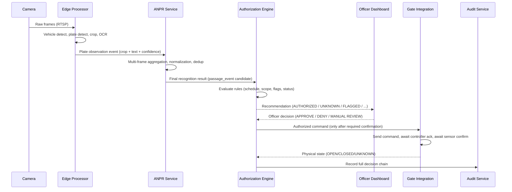
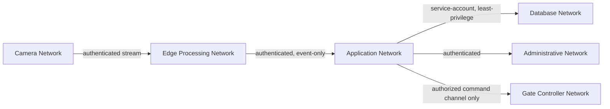

# Architecture — MSU ANPR & Vehicle Access-Control Platform

Status: DRAFT. All network addresses, hostnames, and credentials shown are
placeholders (`<MSU_...>`) and must be replaced by MSU's authorized IT/security
team during deployment planning — see docs/deployment/architecture.md.

## 1. Guiding Separation of Concerns

```
CAMERA            -> detects what is physically present
ANPR              -> estimates the registration number (with confidence)
AUTHORIZATION     -> determines whether that vehicle is permitted, per policy
SECURITY OFFICER  -> makes/confirms the operational decision where required
GATE CONTROLLER   -> executes an authorized physical command
AUDIT SYSTEM      -> records what happened, immutably
```

These responsibilities are implemented as separate services and are never merged.
"ANPR read plate X" never implies "vehicle is authorized" or "gate must open."

## 2. Component Diagram

```mermaid
flowchart TB
    subgraph Campus_Edge["Campus Edge Network (per campus)"]
        CAM[IP Cameras]
        EDGE[Edge Processor\n(camera agent + local ANPR worker + buffer)]
        CAM --> EDGE
    end

    subgraph Core["Central Services (on-prem)"]
        GATEWAY[API Gateway / Reverse Proxy]
        AUTH_SVC[Authentication Service\n(local + optional OIDC)]
        ACCESS_SVC[Access-Control / Authorization Engine]
        ANPR_SVC[ANPR Coordination Service]
        VEH_SVC[Vehicle Registry Service]
        VIS_SVC[Visitor Management Service]
        GATE_SVC[Gate Integration Service]
        ALERT_SVC[Alert Service]
        AUDIT_SVC[Audit Service\n(append-only)]
        REPORT_SVC[Reporting Service]
        NOTIF_SVC[Notification Service]
        MQ[(Message Broker)]
        DB[(PostgreSQL)]
        CACHE[(Redis)]
        OBJSTORE[(Object Storage\nevidence images)]
    end

    subgraph Clients
        DASH[Security Dashboard\nReact/TypeScript]
        ADMIN[Admin Console]
    end

    subgraph Physical["Physical Layer"]
        GATECTRL[Gate Controller Hardware]
        SENSORS[Barrier/Presence Sensors]
    end

    EDGE -- events/plate crops (not raw video) --> MQ
    MQ --> ANPR_SVC
    ANPR_SVC --> ACCESS_SVC
    ACCESS_SVC --> DB
    ACCESS_SVC --> ALERT_SVC
    ACCESS_SVC --> AUDIT_SVC
    ALERT_SVC --> NOTIF_SVC
    ALERT_SVC --> DASH
    ANPR_SVC --> OBJSTORE
    DASH -- officer decision --> ACCESS_SVC
    ACCESS_SVC -- authorized command --> GATE_SVC
    GATE_SVC <--> GATECTRL
    GATECTRL <--> SENSORS
    GATEWAY --> AUTH_SVC
    GATEWAY --> ACCESS_SVC
    GATEWAY --> VEH_SVC
    GATEWAY --> VIS_SVC
    GATEWAY --> REPORT_SVC
    DASH --> GATEWAY
    ADMIN --> GATEWAY
    ACCESS_SVC --> CACHE
    REPORT_SVC --> DB
    AUDIT_SVC --> DB
```

## 3. Data-Flow Diagram — Single Vehicle Passage



## 4. Trust Boundaries



Boundary rules:
- Cameras never have direct database access.
- Gate controllers are never directly reachable from public networks.
- Edge devices authenticate individually (no shared credentials across cameras/edge nodes).
- Administrative interfaces are network-restricted and require MFA.

## 5. Multi-Campus Hierarchy

```
University (MSU)
 └─ Campus (Gweru Main, Harare, Kwekwe, Zvishavane, ... — configurable)
     └─ Gate (configurable per campus)
         └─ Lane (entry/exit, configurable per gate)
             └─ Camera (configurable per lane)
                 └─ Detection / Passage Event
```

Every detection and passage event is tagged with `campus_id`, `gate_id`, `lane_id`,
`camera_id`. Gate/lane/camera counts and names are administrator-configured, not
hard-coded, since the exact MSU topology is not known to this implementation.

## 6. Key Interfaces (implementation contracts)

| Interface | Purpose | Reference implementation | Production adapter |
|---|---|---|---|
| `CameraProvider` | Frame/stream acquisition | `RTSPCameraProvider` | vendor-specific, post site-survey |
| `OCRProvider` | Plate text recognition | `TesseractProvider` (dev) | `PaddleOCRProvider` or specialized model |
| `GateController` | Physical gate command/status | `SimulatorGateController` | vendor adapter, post hardware selection |
| `EvidenceStorage` | Image storage | `LocalStorageProvider` (dev) | `S3StorageProvider` |
| `IdentityProvider` | Auth | `LocalIdentityProvider` | `OIDCProvider` (if MSU IdP available) |
| `NotificationProvider` | Alerting | `EmailProvider` | + optional SMS/institutional messaging |

All are designed to be replaced independently without touching the authorization
or audit logic (Milestone 3–4 will contain the Python interfaces and stub adapters).

## 7. Why edge processing

Continuous raw video is not sent across the campus backbone. The edge processor
performs detection/OCR locally and forwards only structured events plus small
plate-crop images to central services, with local buffering during connectivity
loss and signed synchronization on reconnect (see FR-040).
