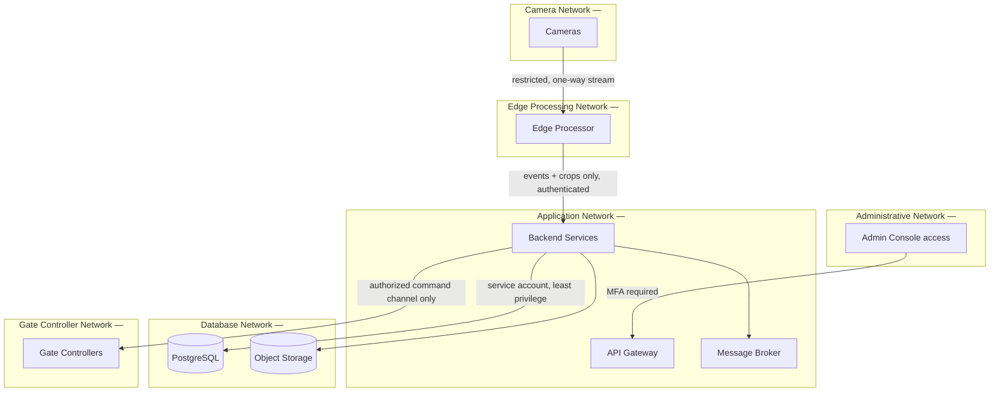

# Deployment Architecture — MSU ANPR & Vehicle Access-Control Platform

Status: DRAFT. All hostnames, IP ranges, and VLAN IDs below are placeholders.
Actual values must come from MSU's authorized IT/network/security team after
a site survey (see §6).

## 1. Network Zones



Firewall defaults: deny-all between zones except the explicit flows shown.
Cameras and gate controllers are never directly reachable from the internet
or from each other's zones.

## 2. Deployment Topology

```mermaid
flowchart LR
    subgraph GweruCampus["Gweru Main Campus"]
        GEdge[Edge Node(s)]
    end
    subgraph HarareCampus["Harare Campus"]
        HEdge[Edge Node(s)]
    end
    subgraph KwekweCampus["Kwekwe Campus"]
        KEdge[Edge Node(s)]
    end
    subgraph ZvishavaneCampus["Zvishavane Campus"]
        ZEdge[Edge Node(s)]
    end
    subgraph SOC["Central / Security Operations Centre (on-prem)"]
        Central[Central Services + DB + Storage]
        Dash[Security Dashboard]
    end
    GEdge --> Central
    HEdge --> Central
    KEdge --> Central
    ZEdge --> Central
    Central --> Dash
```

Each campus runs its own edge node(s), sized to its camera/gate count. Central
services are on-premises by default (per SRS NFR-004 / §398 of the source
requirements) so that vehicle imagery remains within university-controlled
infrastructure unless MSU explicitly approves a cloud component.

## 3. Container/Service Layout (development & staging)

- `docker-compose.yml` (to be produced in Milestone 10) will define: `api-gateway`,
  `auth-service`, `access-control-service`, `anpr-service`, `vehicle-service`,
  `visitor-service`, `gate-service` (with `gate-simulator`), `alert-service`,
  `audit-service`, `reporting-service`, `notification-service`, `postgres`,
  `redis`, message broker, `nginx`, `prometheus`, `grafana`.
- Production uses the same service boundaries under Kubernetes or another
  approved on-prem orchestrator, with real gate/camera adapters replacing
  simulators only after hardware selection and acceptance testing (§4).

## 4. Phased Rollout

| Phase | Activity |
|---|---|
| 1 | Site survey (gate geometry, lighting, power, network, lane width) |
| 2 | Single-gate pilot, ASSISTED mode only, simulator-validated gate integration |
| 3 | Performance validation against local conditions (day/night/rain/glare) |
| 4 | Security review and penetration test (staging/simulator scope) |
| 5 | Additional gates at pilot campus |
| 6 | Campus expansion |
| 7 | Multi-campus expansion |

Automatic Mode is out of scope for every phase until explicitly approved by
MSU following measured accuracy, security review, and operational validation
(SRS FR-024, threat-model T14).

## 5. Environment Separation

`development` → `staging` → `production`, with:
- No production personal data copied into development/staging; synthetic
  fictional vehicle data only (e.g. `MSU 001`, `TEST 123`).
- A production guard preventing non-production builds from connecting to real
  gate controllers or camera credentials.
- Separate secrets per environment; no reused credentials across environments.

## 6. Information MSU Must Supply Before Go-Live

- VLAN IDs / IP ranges for camera, edge, application, database, admin, and
  gate-controller networks (placeholders used throughout: `<MSU_CAMERA_VLAN>`, etc.)
- Gate count, names, and lane layout per campus (Gweru, Harare, Kwekwe,
  Zvishavane, and any others) — not assumed by this design.
- Gate-controller hardware vendor and documented integration protocol.
- Whether an approved OIDC identity provider exists, or local auth should be used.
- Approved notification providers (email/SMS/institutional messaging), SIEM,
  and ticketing system, if any.
- Approved data retention schedule (from MSU governance/privacy function).
- TLS certificate authority / PKI approach for camera and gate-controller links.

## 7. Backup / Disaster Recovery Summary

- Back up: database, configuration, audit records, approved model metadata,
  retained incident evidence. Continuous raw video is not retained by default
  (see SRS §254/§398 equivalent — a separate subsystem would be required if
  MSU mandates continuous video retention).
- RPO/RTO, backup frequency, and restore runbook to be finalized with MSU IT
  during Milestone 10 and validated with a real restore test before go-live.
